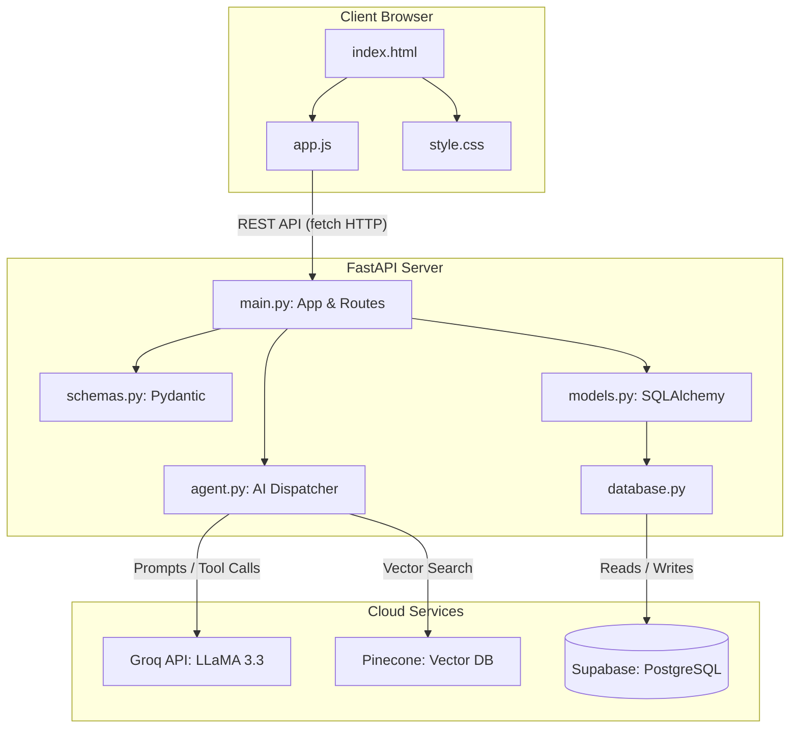

# 🏗️ FlowBoard / CogniPlan – Architecture & Workflow

This document explains the technical architecture, data flow, and development lifecycle for the FlowBoard (CogniPlan) project. It serves as a comprehensive guide to understanding how the system is built and how to work with it effectively.

## 1. System Architecture

The application follows a client-server architecture with a clear separation between the frontend UI and the Python-based backend API. It also integrates an LLM (Groq) for AI capabilities.



### Key Components

1. **Frontend (HTML/CSS/JS):** Served dynamically by FastAPI. Uses clean, vanilla web technologies combined with a responsive, glassmorphism-themed dark UI.
2. **FastAPI Server:** Provides REST API endpoints for todos, habits, state storage, and analytics. Interacts with the frontend using JSON over HTTP.
3. **Database (Supabase PostgreSQL):** Accessed through SQLAlchemy ORM, ensuring robust and schema-validated database migrations and queries.
4. **AI Intelligence Engine:** Driven by the Groq API utilizing `llama-3.3-70b-versatile`. Agent functionality is housed in `agent.py`, which supports specific tool calls to interact directly with the user's tracker (like adding a todo or habit list).

---

## 2. File & Directory Breakdown

* **`backend/`**
  * `main.py`: Entry point for the FastAPI server, defines all endpoints (GET/POST for todos, habits, etc.), and sets up CORS and static routes.
  * `database.py`: Establishes the SQLAlchemy engine and dependency injection (`get_db`) for FastAPI endpoint sessions.
  * `models.py`: Database schema definitions via ORM classes (e.g., `Todo`, `Habit`, `HabitLog`).
  * `schemas.py`: Pydantic models for strict API request validation and response shaping.
  * `agent.py`: Houses the logic for communicating with Groq and Pinecone. Converts user natural language into actionable tool calls.
* **`docs/` (via `frontend/`)**
  * `index.html`: The core page structure, handling auth modals, grid layout, and widget zones.
  * `app.js`: Central logic for component mounting, fetch request handling, API authentication wrapping, and DOM manipulation.
  * `style.css`: All styling variables and design logic matching the premium aesthetic.

---

## 3. Data Flow Example: Adding a Todo via AI

1. User sends a message via the frontend chat interface in `index.html`: *"Remind me to read 10 pages today."*
2. `app.js` runs a `POST /api/chat` request to the backend.
3. `main.py` forwards the message to `agent.run_dispatcher()`.
4. The AI receives the message context, determines the proper intent, and calls the `create_agent_todo` tool instead of providing just a conversational response.
5. In `models.py`, a new `Todo` entity is created and securely saved to the database.
6. The frontend fetches the updated todos list automatically, and the UI immediately displays the newly created Todo item.

---

## 4. Development & Deployment Workflow

The development environment is decoupled from deployment complexities, allowing seamless switching between local testing and production builds.

### 4.1 Local Development (The "Code-Save-Test" Loop)
1. Ensure the Python virtual environment (`.venv`) is activated.
2. Move into the `backend/` directory and execute the server run command:
   ```bash
   uvicorn main:app --reload --host 127.0.0.1 --port 8000
   ```
   *(Alternatively, execute the automated `START_APP.bat` file in the root folder).*
3. Local UI automatically connects via `http://localhost:8000`. Hot reloading ensures instant feedback. Check endpoints by reading CLI output errors.

### 4.2 Shared Hosted Data
Whether deploying via local terminal or via the production cloud target, data resides dynamically on the identical **Supabase Postgres Database**. Environmental configuration files (`.env`) point towards your cloud environment so development seamlessly matches what is shown in production without localized test-database discrepancy issues.

### 4.3 Deployment to Production (Render)
When local features are perfected and tested:
1. Open `docs/app.js`.
2. Disable the localhost endpoints by commenting them out, and uncomment the Render deployment URLs.
3. Check code into Git and Push:
   ```bash
   git add .
   git commit -m "chore: enable production endpoints for release"
   git push origin main
   ```
4. Render's CI/CD pipeline correctly ingests the changes, building the backend API logic and re-wiring the DNS points toward the active build instance automatically.

By leveraging a common database backbone, a split URL toggle logic block, and automated cloud deploy targets, this project enjoys rapid iteration scaling natively built for the modern web lifecycle.
